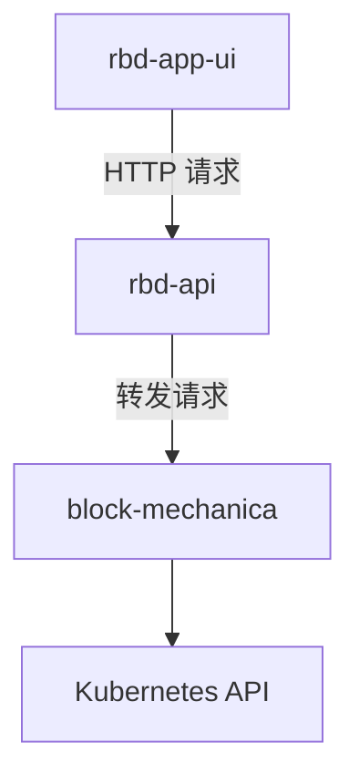

# Block Mechanica

Block Mechanica 是一个轻量化的 Kubernetes 服务，使用 Echo 和 controller-runtime 实现，用于对 KubeBlocks Cluster 进行运维操作，协助 Rainbond 实现 KubeBlocks 的集成

## How does it work?

### 架构

Block Mechanica 由两个 controller 和一个 API 服务组成，其中：

- `kubeblocks_component_controller` 用于监听 KubeBlocks Component，确保 KubeBlocks Component 使用了正确的转发设置，能够将来自其他 Rainbond 组件的连接转发给 KubeBlocks Cluster Service
- `cluster_controller` 用于监听 KubeBlocks Cluster，并根据 KubeBlocks Component 的状态，通过 OpsRequest 同步 Cluster 的状态
- `api_server` 向 Rainbond 提供 API 服务，用于处理 Rainbond 对 KubeBlocks 的各类操作

### KubeBlocks Component 和 KubeBlocks Cluster 的关联是如何实现的

KubeBlocks Cluster 在创建的时候会被添加上与 KubeBlocks Component 相同的  service_id 标签。每个 KubeBlocks Component 的 service_id 都唯一对应一个 KubeBlocks Cluster

### Work with Rainbond



### 专有名词

- KubeBlocks Component: 指在 Rainbond 中用于转发数据库连接给 KubeBlocks 的 Rainbond 组件(Deployment)，目前使用 socat 实现

## 项目结构

```text
📁 ./
├── 📁 api/
│   ├── 📁 handler/
│   ├── 📁 req/
│   └── 📁 res/
├── 📁 controller/
├── 📁 internal/
│   ├── 📁 config/
│   ├── 📁 index/
│   ├── 📁 log/
│   ├── 📁 model/
│   ├── 📁 mono/
│   └── 📁 testutil/
├── 📁 k8s/
└── 📁 service/
    ├── 📁 adapter/
    ├── 📁 backuper/
    ├── 📁 builder/
    └── 📁 coordinator/
```

## Make

- 构建 Docker 镜像（默认标签 latest）

  ```sh
  make image
  ```

- 构建 Docker 镜像并指定标签（如 v1.0.0）

  ```sh
  make image TAG=v1.0.0
  ```

- 构建可执行文件（输出到 bin/block_mechanica）

  ```sh
  make build
  ```

- 运行所有测试（递归所有目录）

  ```sh
  make test
  ```

- 运行指定目录下的测试（如 service 目录）

  ```sh
  make test TESTDIR=./service/...
  ```
